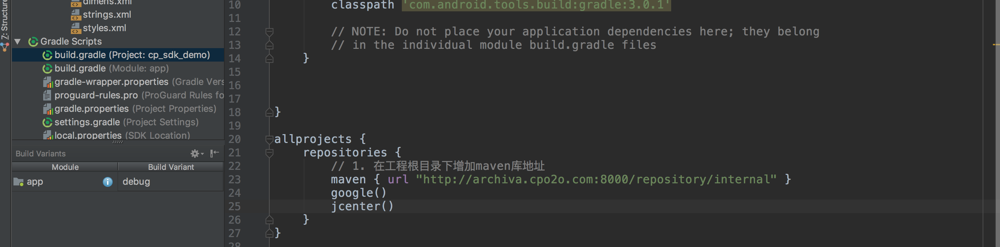
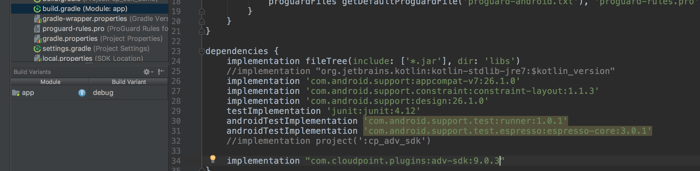
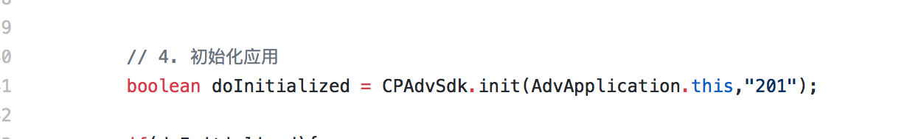
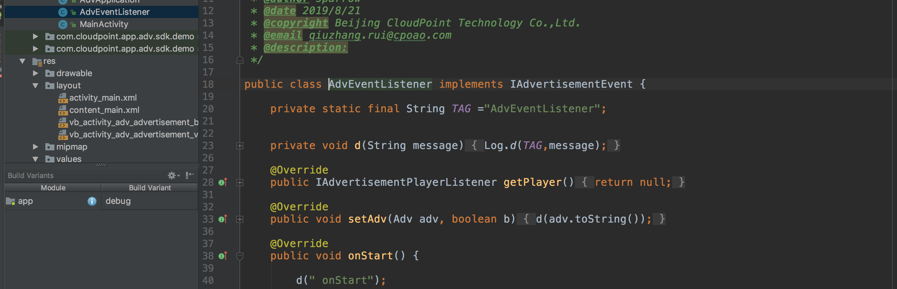
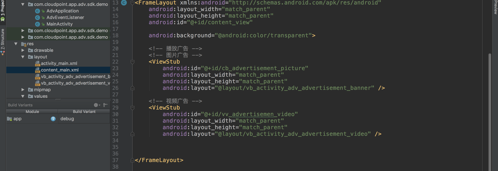
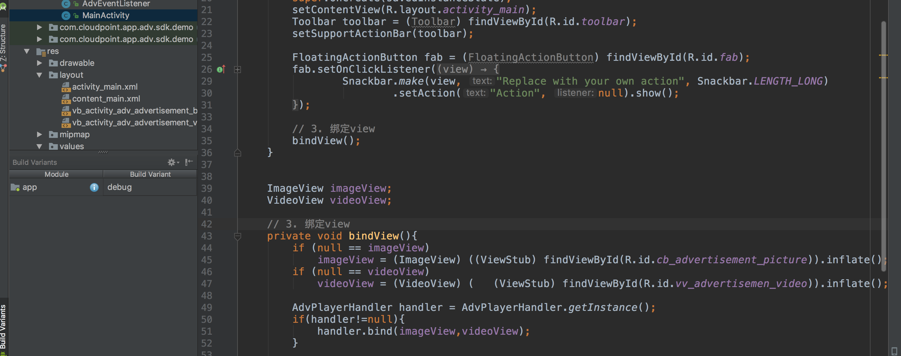
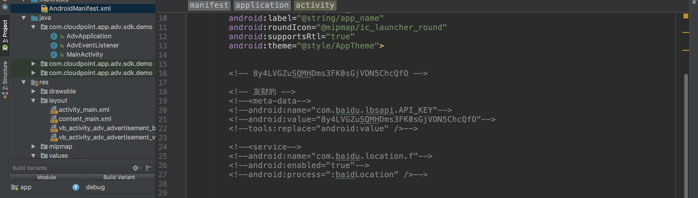
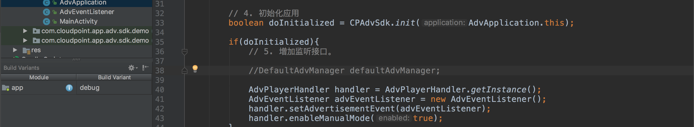
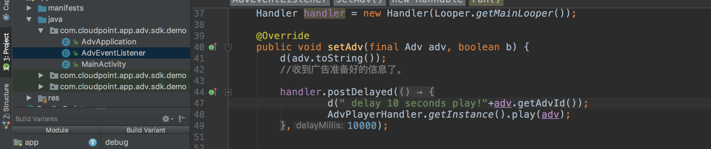

##云点广告sdk接入文档


### 广告接入步骤


##### 1. 工程目录下build.gradle增加maven库地址



```
maven { url "http://archiva.cpo2o.com:8000/repository/internal" }
```

##### 2. app目录下build.gradle增加sdk依赖



```
implementation "com.cloudpoint.plugins:adv-sdk:9.0.3"s
```
##### 3. Application中初化



#### 4.创建广告播放状态监听




#### 5.创建播放器容器



##### 6. Activity中绑定播放器组件




#### 7.增加百度定位sdk密钥





#### 8. 启用控制播放（延时播放）



#### 9. 接收信息及延时播放




