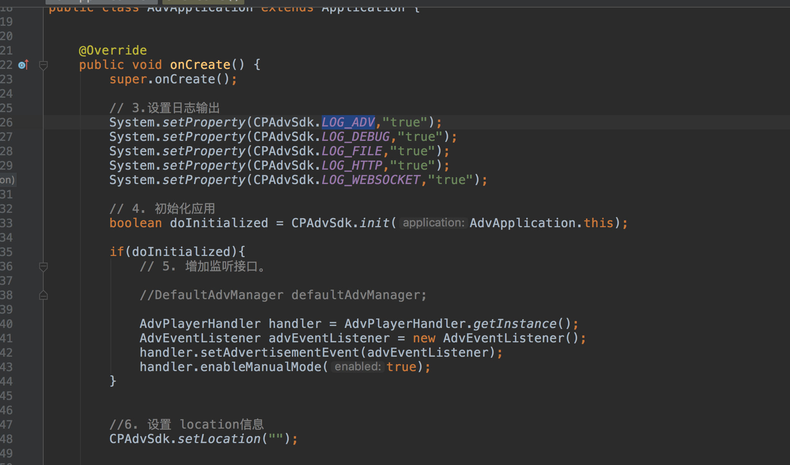
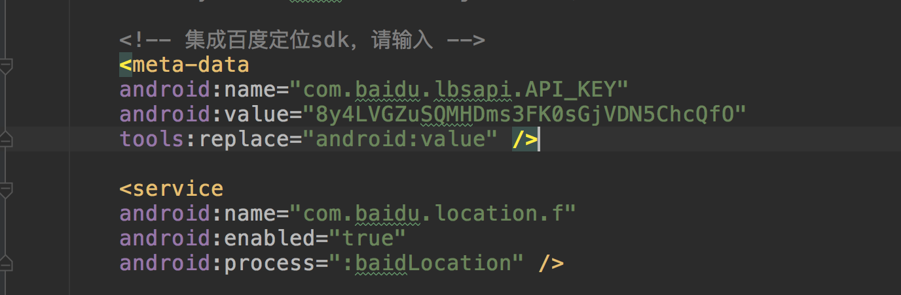
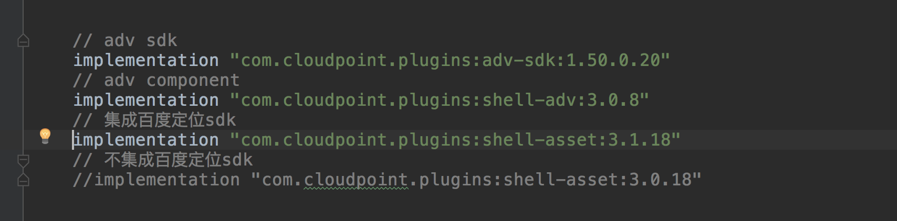

##云点广告sdk接入文档


**注意**
```
1. 同一设备上只能有一个apk集成sdk，多个集成sdk的应用运行时会不正常
2. 一定要设置设备的位置信息
```


### 广告接入步骤


##### 1. 工程目录下build.gradle增加maven库地址


```
maven { url "http://archiva.cpo2o.com:8000/repository/internal" }
```

##### 2. app目录下build.gradle增加sdk依赖


```
implementation "com.cloudpoint.plugins:adv-sdk:1.50.0.26"
```
##### 3. Application中初化


#### 4.创建广告播放状态监听


#### 5.创建播放器容器


##### 6. Activity中绑定播放器组件


#### 7.增加百度定位sdk密钥


#### 8. 启用控制播放（延时播放）


#### 9. 接收信息及延时播放


#### 10.设置位置信息

```
{"location":{"address":"中国北京市朝阳区北苑路229号","city":"北京市","disrict":"朝阳区","location_desc":"在金泉港附近","province":"北京市","street":"北苑路"},"gps":{"coor_type":"bd09ll","error_code":161,"langtitude":116.423292,"latitude":40.010727,"radius":50.499428}}
```



#### 11.设置开关轮播图


##### 12.集成百度定位sdk



- 使用百度定位sdk时,修改AndroidManifest.xml中百度的key值


- 设置loc 为空




- 启用集成百度定位sdk asset

	- 3.0.x 为不集成百度定位sdk的asset版本
	- 3.1.x 为集成百度定位sdkasset版本

```

    // adv sdk (with baidu location api)
    implementation "com.cloudpoint.plugins:adv-sdk:1.50.0.26"

    //集成百度定位api
    //implementation "com.cloudpoint.plugins:shell-asset:3.1.42"
    // TODO: 未集成百度定位api 取消以下注释使用自定位系统
     implementation "com.cloudpoint.plugins:shell-asset:3.0.42"


```


##### 13.广告sdk（关闭/开启）

```
	handler.enableAdv(true); //开启
	handler.enableAdv(false); //关闭
	
```

